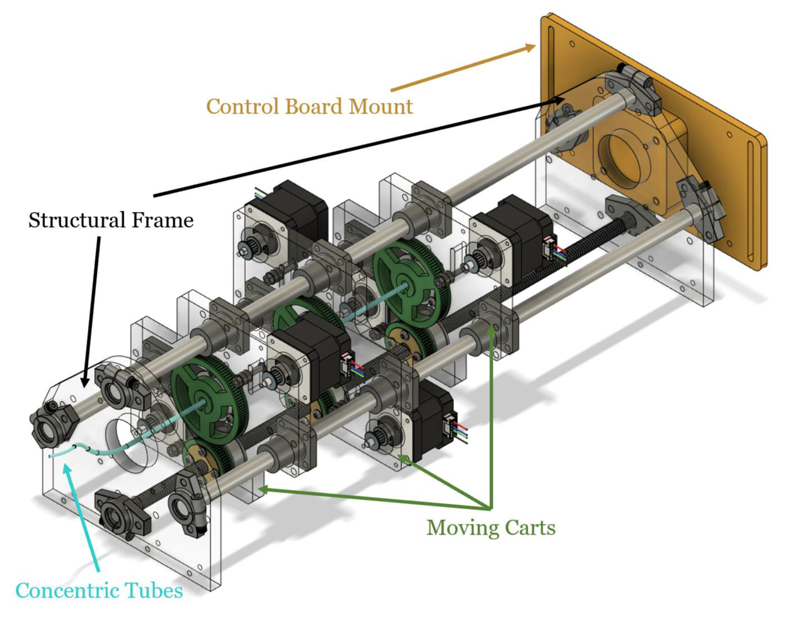
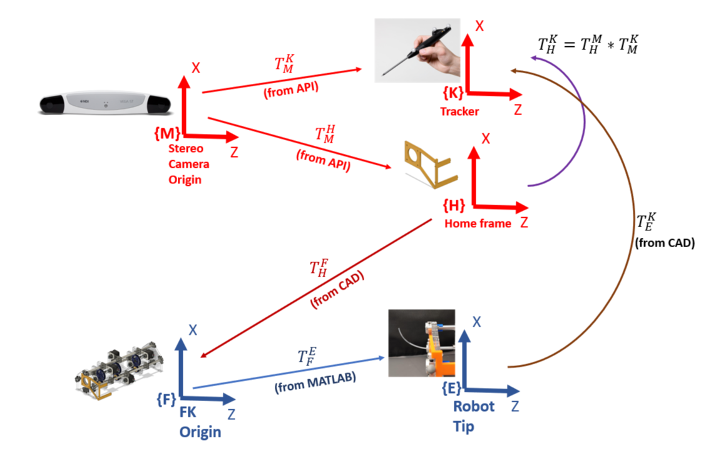

# Concentric Tube Robots for Minimally Invasive Surgery

### Abstract
This project focused on the modeling, fabrication, and kinematic validation of concentric tube continuum robots for minimally invasive surgical applications. A two-tube robot was designed using additive manufacturing techniques, and inverse kinematics were derived using Euler–Bernoulli beam theory and energy minimization principles. The proposed modeling approach was experimentally validated using vision-based motion capture to assess kinematic accuracy.

---

### Modeling

*Segmented curvature-based modeling of concentric tubes illustrating curvature, twist, and section lengths. Adapted from Webster, Romano, and Cowan, “Kinematics and Calibration of Active Cannulas,” IEEE ICRA 2008.*

---

### Fabrication and Experimental Platform

*3D-printed concentric tube robot and experimental platform used for validation.*

---

### Kinematic Verification

*Comparison between predicted configurations and measured robot shapes during validation experiments.*

---

### Technical Contributions
- Developed a segmented curvature-based kinematic model using energy minimization.
- Designed and fabricated a two-tube continuum robot using additive manufacturing.
- Derived and implemented inverse kinematics for model-based control.
- Performed experimental validation using vision-based motion capture.

### Methods
Continuum robotics, beam theory, inverse kinematics, energy minimization, additive manufacturing, vision-based motion capture.

### Outcome
Demonstrated accurate kinematic prediction and experimental validation of concentric tube robot behavior. Detailed derivations and extended results are provided in the full project documentation.

---

### Links
- Manufacturing notes and fabrication details (Notion): [link](https://jewel-louse-b60.notion.site/Concentric-Tube-Robot-Educational-Platform-7b1a04f343eb4cfabc8706df61d023d7)

[← Back to Projects](/projects)