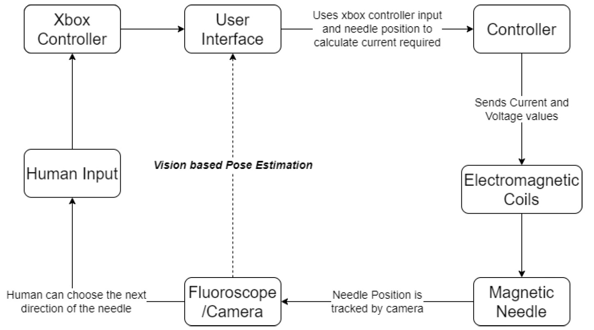

# Magnetically Actuated Suturing Needles

### Abstract
This project investigates the feasibility of magnetically actuated suturing needles for subcutaneous suturing under image guidance. An electromagnetic actuation system was designed to control needle translation and rotation, with feedback obtained from vision and fluoroscopic imaging. Vision-based pose estimation was integrated with closed-loop control to achieve accurate needle manipulation. The system was validated through phantom experiments, demonstrating controlled needle trajectories suitable for suturing patterns.

---

### System Overview

---

### Control and Perception

---

---

### Experimental Validation
Closed-loop magnetic needle control was evaluated by executing purse-string trajectories under two imaging modalities.

**Camera Feedback**
<video controls width="100%">
  <source src="../assets/magnetic-suturing/camera.mp4" type="video/mp4">
  Your browser does not support the video tag.
</video>

**Fluoroscopic Feedback**
<video controls width="100%">
  <source src="../assets/magnetic-suturing/fluoroscope.mp4" type="video/mp4">
  Your browser does not support the video tag.
</video>

---

### Links
- Full project PDF
- Experiment videos

[← Back to Projects](/projects)
