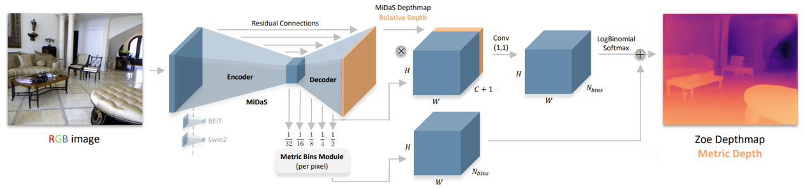
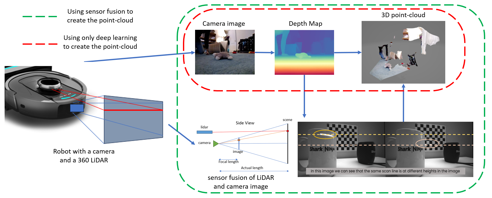

# Monocular Depth Estimation

### Abstract
This project investigates monocular depth estimation for robotic perception using a single RGB camera. Deep learning models were evaluated to generate relative and absolute depth maps, which were subsequently used to construct dense 3D point clouds. The approach enables improved obstacle perception and mapping in scenarios where dedicated depth sensors are limited or unavailable. Quantitative evaluation was performed by comparing estimated depth against ground-truth measurements from range sensors.

---

### Depth Estimation Approach

*Encoder–decoder based monocular depth estimation using RGB input images.*

---

### Point Cloud Generation

*Construction of dense 3D point clouds from monocular depth maps, with and without sensor fusion.*

---

### Quantitative Evaluation

*Comparison of estimated depth against ground-truth measurements, demonstrating low relative error.*

---

### Technical Contributions
- Evaluated deep learning models for monocular depth estimation from RGB images.
- Generated dense 3D point clouds for robotic perception and obstacle avoidance.
- Integrated depth estimation with sensor fusion pipelines.
- Performed quantitative benchmarking against ground-truth depth sensors.

### Methods
Monocular depth estimation, deep learning, point cloud generation, sensor fusion, robotic perception.

### Outcome
Demonstrated accurate depth estimation and point cloud reconstruction using a single camera, suitable for real-time robotic perception.

[← Back to Projects](/projects)