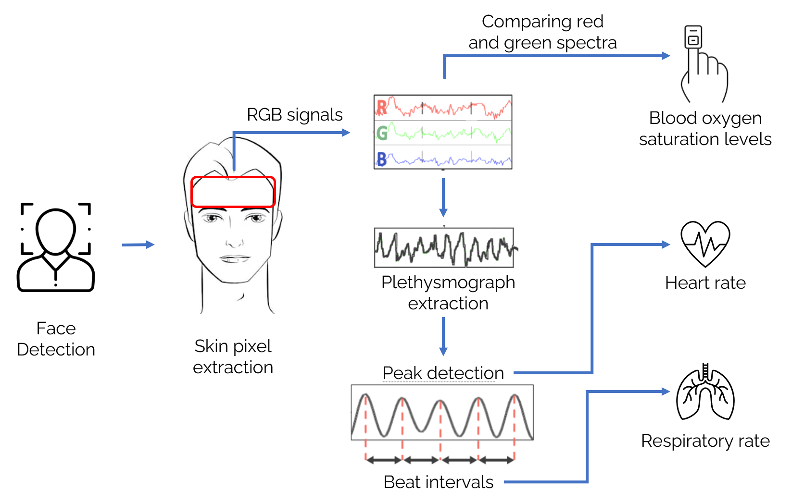
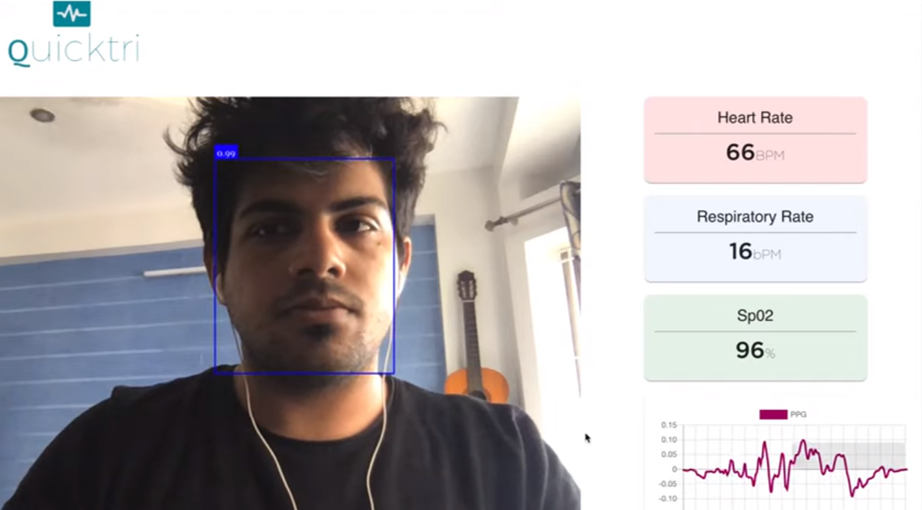

# QuickTri: Non-contact Vitals Monitoring

### Abstract
QuickTri is a non-contact system for estimating physiological vital signs using video-based photoplethysmography. The system extracts physiological signals from RGB video captured by a standard webcam to estimate heart rate, respiratory rate, and blood oxygen saturation. A signal processing pipeline was developed to isolate skin pixels, extract plethysmographic signals, and compute vital parameters in real time. The approach enables remote triaging without physical sensors or specialized hardware.

---

### Signal Processing Pipeline

*Pipeline for extracting physiological signals from RGB video and estimating vital signs.*

---

### System Demonstration

*Real-time estimation of heart rate, respiratory rate, and oxygen saturation using a consumer-grade webcam.*

---

### Technical Contributions
- Developed a video-based photoplethysmography pipeline using RGB signals.
- Implemented signal extraction and peak detection for vital sign estimation.
- Designed a non-contact, privacy-preserving system compatible with consumer hardware.
- Demonstrated real-time vitals monitoring without specialized sensors.

### Methods
Computer vision, signal processing, remote photoplethysmography (rPPG).

### Outcome
Winning project at the MIT COVID-19 Hackathon.

[← Back to Projects](/projects)