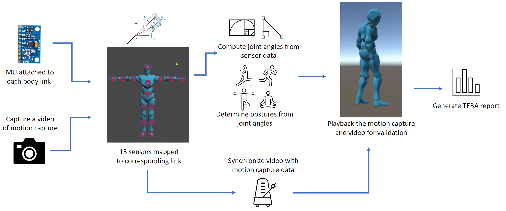
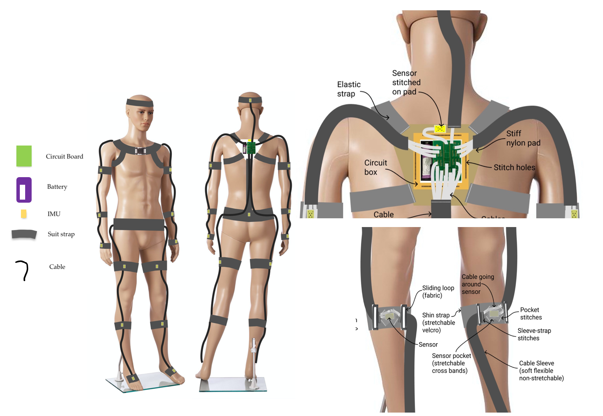
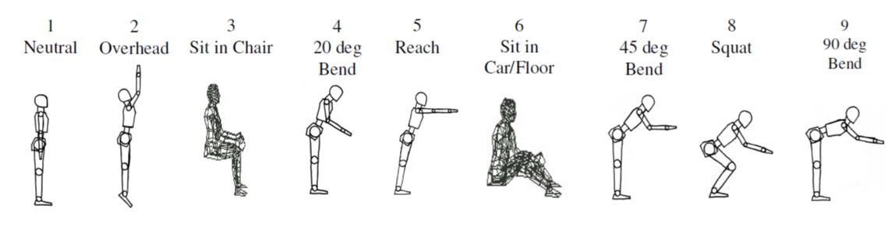

# Total Ergonomic Burden Assessment (TEBA)

### Abstract
This project developed a quantitative framework to assess ergonomic burden based on human posture and motion in industrial environments. A wearable motion capture system using inertial measurement units (IMUs) was designed to estimate joint kinematics in real time. Sensor data were filtered and fused using an Extended Kalman Filter and mapped to a virtual human model for posture classification. The resulting posture indices were used to compute ergonomic burden scores, enabling early identification of high-risk tasks without reliance on optical tracking.

---

### System Pipeline

*IMU-based sensing and estimation pipeline mapping raw inertial data to posture classification and ergonomic burden scoring.*

---

### Wearable Embodiment

*Jacket-based embodiment with distributed inertial sensors enabling motion capture without line-of-sight constraints.*

---

### Posture Classification

*Posture taxonomy used to map estimated joint kinematics to ergonomic burden indices.*

---

### Technical Contributions
- Designed a wearable IMU-based motion capture system for industrial ergonomic assessment.
- Implemented sensor fusion using an Extended Kalman Filter for joint angle estimation.
- Developed a posture classification and indexing scheme for ergonomic burden scoring.
- Integrated real-time visualization and validation using a virtual human model.

### Methods
Wearable sensing, IMU calibration, Extended Kalman Filtering, human motion capture, posture classification.

### Outcome
Demonstrated automated ergonomic burden assessment without reliance on optical tracking, suitable for deployment in factory environments.

[← Back to Projects](/projects)